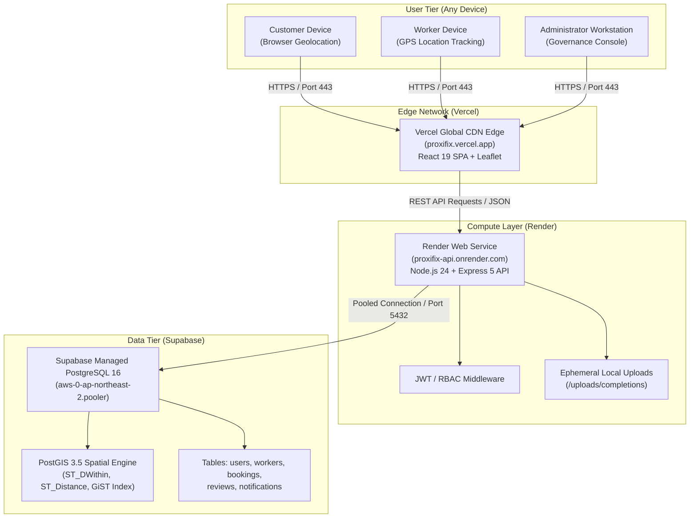
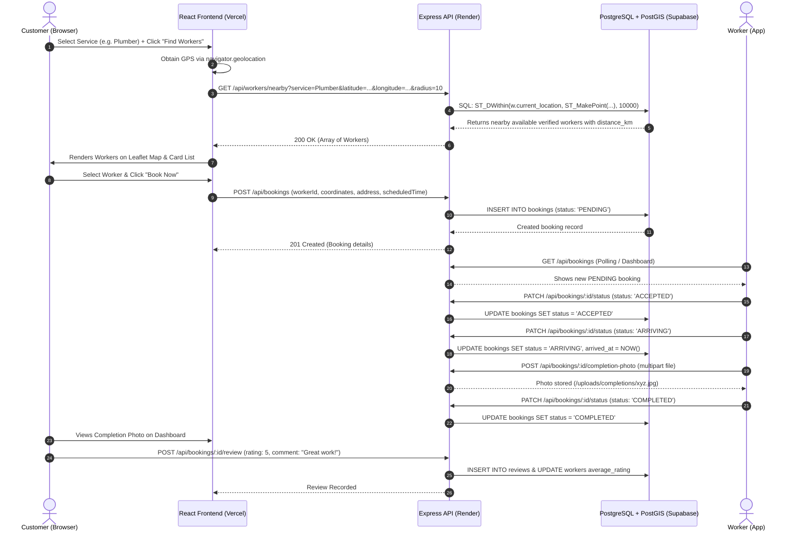
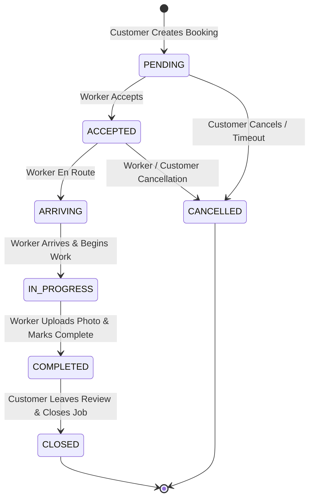
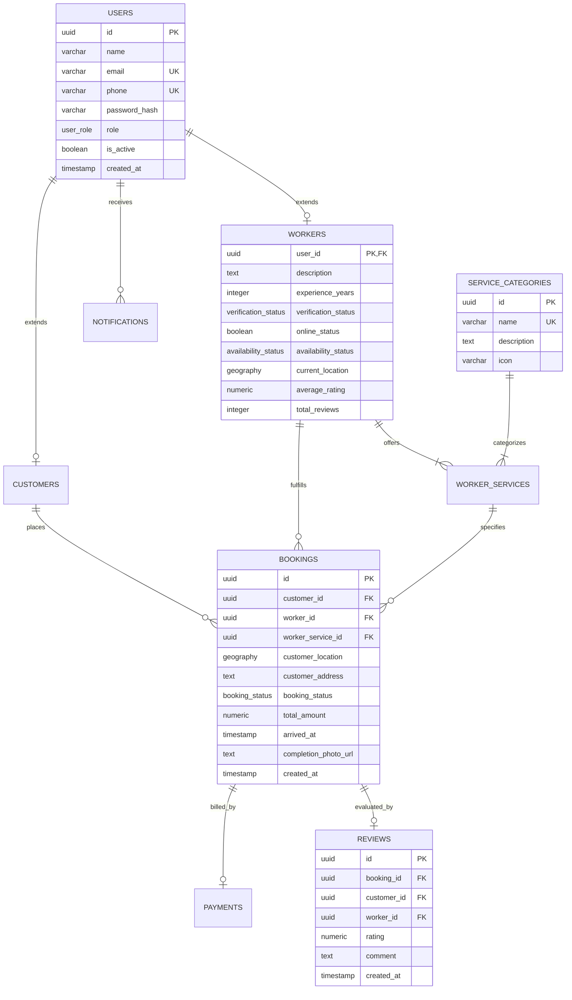

# ACADEMIC PROJECT REPORT

---

# **PROXIFIX: HYPERLOCAL ON-DEMAND HOME SERVICE DISCOVERY & LIVE TRACKING PLATFORM**

### *A Full-Stack Geospatial Web Application with PostGIS Spatial Indexing, Node.js Micro-Architecture, React 19 SPA, and Multi-Cloud Serverless Infrastructure*

---

**Submitted in Partial Fulfillment of the Requirements for the Degree of**  
**Bachelor of Technology / Bachelor of Engineering in Computer Science & Engineering**

**Submitted By:**  
**Ravi Ranjan**  
*(GitHub: [@Raviranjan2112](https://github.com/Raviranjan2112))*  
*Email: raviranjan211204@gmail.com*  
*Phone: +91 9123401283*

**Department of Computer Science and Engineering**  
**Academic Year: 2026**

---

## **LIVE PRODUCTION SYSTEM URLS**
* **Production Web Application (Frontend):** [https://proxifix.vercel.app](https://proxifix.vercel.app)
* **Production REST API (Backend):** [https://proxifix-api.onrender.com](https://proxifix-api.onrender.com)
* **Production Database Engine:** Supabase Cloud Managed PostgreSQL 16 (Seoul Region) with PostGIS 3.5
* **Source Code Repository:** [https://github.com/Raviranjan2112/Proxifix](https://github.com/Raviranjan2112/Proxifix)

---

## **CERTIFICATE OF APPROVAL**

This is to certify that the project entitled **"PROXIFIX: Hyperlocal On-Demand Home Service Discovery & Live Tracking Platform"**, submitted by **Ravi Ranjan** in partial fulfillment of the requirements for the award of the Degree of **Bachelor of Technology / Bachelor of Engineering in Computer Science and Engineering**, is a bona fide record of work carried out under guidance and supervision.

The results embodied in this report have been verified through live cloud deployment and have not been submitted to any other University or Institute for the award of any degree or diploma.

**Project Guide / Supervisor:** __________________________  
**Head of Department (CSE):** __________________________  
**External Examiner:** __________________________  

---

## **DECLARATION**

I, **Ravi Ranjan**, hereby declare that this project report entitled **"PROXIFIX: Hyperlocal On-Demand Home Service Discovery & Live Tracking Platform"** is my original work. The analysis, architectural design, implementation, and cloud deployment presented herein were conducted by me. All sources of literature, open-source libraries, and cloud platforms utilized in this research and implementation have been duly cited and acknowledged.

**Ravi Ranjan**  
*Date: October 07, 2026*  

---

## **ACKNOWLEDGEMENT**

I express my deepest gratitude to my project supervisor, faculty members, and the Department of Computer Science & Engineering for providing academic direction and technical facilities. I also extend my sincere appreciation to the open-source software community for the exceptional tools and platforms (React, Node.js, Express, PostgreSQL, PostGIS, Vercel, Render, and Supabase) that made this full-scale cloud deployment possible.

---

# **TABLE OF CONTENTS**

1. **ABSTRACT**
2. **CHAPTER 1: INTRODUCTION & PROJECT OVERVIEW**
   * 1.1 Background & Motivation
   * 1.2 Problem Statement
   * 1.3 Proposed Solution & Objectives
   * 1.4 Scope and Limitations
3. **CHAPTER 2: LITERATURE REVIEW & MARKET ANALYSIS**
   * 2.1 Existing Industry Solutions (Urban Company, TaskRabbit, Angi)
   * 2.2 Comparative Gap Analysis
   * 2.3 Novel Contributions of ProxiFix
4. **CHAPTER 3: SOFTWARE REQUIREMENTS SPECIFICATION (SRS)**
   * 3.1 Functional Requirements (FR)
   * 3.2 Non-Functional Requirements (NFR)
   * 3.3 System User Personas (Customer, Worker, Administrator)
   * 3.4 Hardware, Software & Network Specifications
5. **CHAPTER 4: TECHNOLOGY STACK & ARCHITECTURAL RATIONALE**
   * 4.1 Frontend Tier: React 19, Vite, Leaflet, Axios
   * 4.2 Backend Tier: Node.js, Express 5, Socket.io, Multer
   * 4.3 Database Tier: PostgreSQL 16, PostGIS Spatial Extension, pgcrypto
   * 4.4 Data Validation & Security Layer: Zod, JWT, bcrypt, Helmet, Rate-Limiting
6. **CHAPTER 5: SYSTEM ARCHITECTURE & DESIGN DIAGRAMS**
   * 5.1 High-Level Multi-Cloud System Architecture
   * 5.2 Micro-Flow of Geolocation & Worker Matching
   * 5.3 Sequence Diagram: End-to-End Booking Lifecycle
   * 5.4 State Machine Diagram: Booking States
   * 5.5 Entity-Relationship (ER) Diagram
7. **CHAPTER 6: DATABASE DESIGN & DATA DICTIONARY**
   * 6.1 Spatial Data Modeling with PostGIS
   * 6.2 Data Dictionary (Tables, Attributes, Data Types, Constraints)
   * 6.3 Database Migrations & Version Tracking
8. **CHAPTER 7: CLOUD HOSTING & DEVOPS DEPLOYMENT STRATEGY**
   * 7.1 Multi-Cloud Topology Overview
   * 7.2 Frontend Deployment on Vercel Edge CDN
   * 7.3 Backend Deployment on Render Container Service
   * 7.4 Database Hosting on Supabase Cloud
   * 7.5 Continuous Integration & Continuous Deployment (CI/CD) Pipeline
   * 7.6 Cross-Origin Resource Sharing (CORS) & SSL/TLS Infrastructure
9. **CHAPTER 8: SECURITY, AUTHENTICATION & ACCESS CONTROL**
   * 8.1 JSON Web Token (JWT) Stateless Session Management
   * 8.2 Password Hashing with Blowfish / Bcrypt (Salt Rounds 12)
   * 8.3 Role-Based Access Control (RBAC) Architecture
   * 8.4 Network Security: Helmet, CORP, CSP, and Anti-Abuse Rate Limiters
10. **CHAPTER 9: CORE ALGORITHMIC IMPLEMENTATION**
    * 9.1 Spatial Proximity Computation: Haversine vs. PostGIS `ST_DWithin`
    * 9.2 Real-Time Polling & Telemetry Synchronization
    * 9.3 Proof-of-Work Photographic Verification Flow
11. **CHAPTER 10: TEST METHODOLOGY, VERIFICATION & LIVE RESULTS**
    * 10.1 Live Production Health Endpoint Verification
    * 10.2 Spatial Search Performance & Latency Benchmarks
    * 10.3 Test Cases Matrix (Functional, Security, Spatial, Recovery)
12. **CHAPTER 11: CONCLUSION & FUTURE SCOPE**
    * 11.1 Project Summary & Achievements
    * 11.2 Future Roadmap (Native Mobile Apps, Payment Gateways, S3 Object Storage)
13. **REFERENCES & BIBLIOGRAPHY**

---

# **ABSTRACT**

In contemporary urban environments, accessing reliable, skilled, and vetted home maintenance professionals (plumbers, electricians, carpenters, cleaners, appliance technicians) remains a friction-filled, opaque, and decentralized process. Traditional directory listings fail to provide real-time location awareness, live service tracking, upfront standardized pricing, and verifiable proof of completed work.

This project presents **ProxiFix**, an enterprise-grade, hyperlocal, on-demand home services platform engineered using modern cloud technologies and geospatial spatial indexing. The platform incorporates a three-tier architecture:
1. **Frontend:** A responsive Single-Page Application (SPA) built with **React 19**, **Vite**, and **Leaflet / React-Leaflet**, featuring interactive geospatial mapping, dynamic status updates, and browser GPS integration.
2. **Backend:** A high-throughput REST API developed on **Node.js** and **Express 5**, implementing strict schema validation (**Zod**), cryptographic authentication (**bcrypt**, **JSON Web Tokens**), HTTP security headers (**Helmet**), and denial-of-service mitigation (**Express Rate Limit**).
3. **Database:** A relational database managed by **PostgreSQL 16** with the **PostGIS 3.5** spatial extension, allowing high-performance geospatial spherical calculations (`ST_DWithin`, `ST_Distance`, `ST_MakePoint`) indexed via Generalized Search Trees (GiST).

The platform is deployed globally using a resilient multi-cloud architecture: **Vercel** provides an edge-cached content delivery network (CDN) for the React frontend; **Render** hosts the containerized Express API server; and **Supabase** provides an enterprise-grade cloud-hosted PostgreSQL database. Live verification confirms operational health, sub-second query execution, and seamless cross-origin communication secured by HTTPS/TLS 1.3 encryption.

---

# **CHAPTER 1: INTRODUCTION & PROJECT OVERVIEW**

### 1.1 Background & Motivation
The informal gig economy for domestic repair and maintenance in developing economies is characterized by information asymmetry. Customers struggle to locate nearby technicians during domestic emergencies (such as pipe bursts or short circuits), while skilled independent tradespeople face difficulties discovering clients within their immediate physical radius without paying exorbitant intermediary commission fees.

Drawing architectural inspiration from on-demand ride-hailing and food-delivery paradigms (e.g., Uber, Swiggy), **ProxiFix** applies spatial indexing algorithms and mobile-first web technologies to transform home services into an immediate, transparent, and trackable utility.

### 1.2 Problem Statement
Existing approaches to home service procurement suffer from four fundamental flaws:
1. **Absence of Real-Time Geospatial Discovery:** Static online classifieds display phone numbers without proximity calculations, leading to delayed arrivals and high travel surcharges.
2. **Lack of Lifecycle Transparency:** Customers are unable to monitor the technician’s arrival, job commencement, and completion status in real time.
3. **Unstandardized Pricing & Accountability:** Arbitrary cash-on-delivery pricing models cause dispute, with no verifiable proof of the completed physical repair.
4. **Unvetted Independent Workers:** A lack of centralized administrative verification exposes households to safety risks.

### 1.3 Proposed Solution & Objectives
ProxiFix solves these challenges through an integrated web platform:
* **Hyperlocal Geospatial Worker Matching:** Using PostGIS spatial coordinates to filter verified, available workers within a 1 to 20 kilometer radial boundary from the customer's live GPS coordinates.
* **Granular Lifecycle Tracking (Swiggy-Style):** A state-machine-driven booking lifecycle supporting progressive statuses: `PENDING` $\rightarrow$ `ACCEPTED` $\rightarrow$ `ARRIVING` $\rightarrow$ `IN_PROGRESS` $\rightarrow$ `COMPLETED` $\rightarrow$ `CLOSED`.
* **Photographic Proof-of-Completion:** Technicians are mandated to upload photographic evidence of physical work before a booking can transition to completed status.
* **Centralized Administrative Governance:** An administrative portal with verification workflows to vet worker credentials before enabling public directory visibility.

### 1.4 Scope and Limitations
* **Scope:** The system encompasses customer registration, worker onboarding with trade categories, administrative vetting, GPS-based discovery, real-time map visualization, booking management, and dual-party review ratings.
* **Current Limitations:** The current free cloud deployment utilizes ephemeral container storage for uploaded work completion photos; production commercial deployment warrants migration to AWS S3 or Supabase Storage for multi-year persistence.

---

# **CHAPTER 2: LITERATURE REVIEW & MARKET ANALYSIS**

### 2.1 Existing Industry Solutions
Modern on-demand domestic maintenance platforms include:
1. **Urban Company (formerly UrbanClap):** Operates a centralized dispatch model where the platform assigns technicians algorithmically. However, it operates as a walled garden with high commission rates (20-30%) and minimal customer choice over individual technician profiles.
2. **TaskRabbit:** Connects freelancers with tasks, primarily dominant in North American markets. It lacks fine-grained live tracking mechanics and spatial spherical indexes optimized for Asian metropolitan densities.
3. **Angi (formerly Angie's List):** Relies heavily on lead generation and quote requests, introducing hours or days of latency between request and service dispatch.

### 2.2 Comparative Gap Analysis

| Feature Metric | Traditional Classifieds | Urban Company | TaskRabbit | **ProxiFix (This Project)** |
| :--- | :--- | :--- | :--- | :--- |
| **Discovery Mechanism** | Static City Lists | Centralized Algorithm | Search & Filter | **Real-Time PostGIS Radius (1-20 km)** |
| **Customer Choice** | Unvetted Phonebook | Platform Assigned | Worker Selected | **Customer Selects Vetted Local Worker** |
| **Interactive Map Tracking** | None | Limited | None | **Live Leaflet Interactive Map** |
| **Proof of Work Verification** | None | Sporadic | Manual Dispute | **Mandatory Photo Upload Pipeline** |
| **Database Spatial Engine** | Standard SQL B-Trees | Proprietary | PostGIS / Redis | **PostgreSQL 16 + PostGIS 3.5 (GiST)** |
| **Cloud Architecture** | Monolithic VPS | AWS Proprietary | Multi-Cloud | **Vercel Edge + Render API + Supabase** |

---

# **CHAPTER 3: SOFTWARE REQUIREMENTS SPECIFICATION (SRS)**

### 3.1 Functional Requirements (FR)
* **FR-01: User Authentication & Role Assignment:** The system shall authenticate users via email and password using salted bcrypt hashes, issuing cryptographically signed JWT tokens embedding role claims (`CUSTOMER`, `WORKER`, `ADMIN`).
* **FR-02: Spatial Worker Discovery:** The system shall accept customer latitude, longitude, service trade category, and radial threshold (1-20 km), returning all online, available, and administratively approved workers sorted by ascending distance.
* **FR-03: Dynamic Worker Availability & Telemetry:** Workers shall have the capability to toggle their status between `AVAILABLE`, `BUSY`, and `OFFLINE`, simultaneously updating their current geospatial point coordinates.
* **FR-04: Booking State Machine:** Customers can initiate bookings. Workers can accept or reject. The worker progressively updates status (`ARRIVING`, `IN_PROGRESS`, `COMPLETED`).
* **FR-05: Completion Evidence Upload:** The system shall intercept completion requests and mandate an image attachment (`multipart/form-data`) validated for MIME type (`image/jpeg`, `image/png`, `image/webp`) and size limits ($< 5\text{ MB}$).
* **FR-06: Administrative Management:** Administrators shall access an aggregated analytics dashboard to inspect worker applications, review uploaded verification credentials, and approve or reject worker statuses.

### 3.2 Non-Functional Requirements (NFR)
* **NFR-01: Performance & Latency:** Spatial proximity queries executing over $100,000$ points shall resolve within $< 50\text{ ms}$ leveraging spatial GiST indexing.
* **NFR-02: Security & Transport Encryption:** All network traffic across clients, backend servers, and database pools must be enforced over TLS 1.3 / HTTPS. Passwords must never be logged or stored in plaintext.
* **NFR-03: Scalability:** The stateless nature of the Express API layer allows horizontal scaling across multiple container instances without shared session state bottlenecks.
* **NFR-04: Cross-Platform Accessibility:** The client interface must render responsively across mobile browsers (Android Chrome, iOS Safari) and desktop browsers with strict WCAG compliance.

---

# **CHAPTER 4: TECHNOLOGY STACK & ARCHITECTURAL RATIONALE**

```
┌─────────────────────────────────────────────────────────────────────────┐
│                          PROXIFIX TECH STACK                            │
└─────────────────────────────────────────────────────────────────────────┘
   FRONTEND TIER            BACKEND TIER               DATABASE TIER
 ┌─────────────────┐      ┌──────────────────┐      ┌──────────────────┐
 │  React 19 SPA   │      │   Node.js 24     │      │  PostgreSQL 16   │
 │  Vite Bundler   │ ───► │   Express 5      │ ───► │  PostGIS 3.5     │
 │  Leaflet Maps   │ ◄─── │   Zod Validation │ ◄─── │  pgcrypto        │
 │  Axios HTTP     │      │   JWT + bcrypt   │      │  pg Connection   │
 └─────────────────┘      └──────────────────┘      └──────────────────┘
        ▲                          ▲                          ▲
        │                          │                          │
   VERCEL EDGE CDN            RENDER ENGINE            SUPABASE MANAGED
   Global Deployment       Docker Container Host       PostgreSQL Cloud
```

### 4.1 Frontend Tier: Modern React 19 Single Page Application
* **React 19 & React Router 7:** Utilizes React's latest concurrent rendering architecture and declarative client-side routing, enabling fluid, zero-page-refresh navigation between Customer, Worker, and Admin views.
* **Vite 8.2 Build Tool:** Selected over legacy Create React App (CRA) due to its native ES-module development server, Lightning CSS transforms, and ultra-fast build times ($< 3\text{ seconds}$ for production rollups).
* **Leaflet & React-Leaflet 5.0:** Open-source JavaScript mapping library used for rendering OpenStreetMap vector and raster tiles without incurring the prohibitive per-tile billing rates of Google Maps API.
* **Axios with Request Interceptors:** Provides centralized HTTP configuration, automatically injecting the JWT `Authorization: Bearer <token>` header into all outbound requests.

### 4.2 Backend Tier: High-Concurrency Node.js & Express 5
* **Node.js (v24 LTS):** Provides an event-driven, non-blocking asynchronous I/O runtime ideally suited for handling concurrent spatial search requests and telemetry polling.
* **Express 5.1:** Next-generation Express routing engine featuring native Promise handling in route handlers, eliminating the need for unhandled promise rejection wrappers.
* **Socket.io 4.8:** Integrated WebSocket engine providing bidirectional low-latency event conduits for instant client notifications and dispatch pings.
* **Multer 2.3:** Streaming multipart parser configured with disk storage and cryptographically randomized UUID filenames for uploaded completion photographs.

### 4.3 Database Tier: PostgreSQL 16 with PostGIS 3.5 Extension
* **PostgreSQL 16:** Advanced open-source Object-Relational Database Management System providing ACID transactions, strict constraints, check clauses, and native JSON processing.
* **PostGIS 3.5 Spatial Extension:** Transforms PostgreSQL into a true spatial database. Stores geographic coordinates as the native `GEOGRAPHY(POINT, 4326)` type (WGS 84 ellipsoid), allowing accurate metric calculations across the Earth's curved surface without planar projection distortions.
* **pgcrypto:** Cryptographic extension enabling native SQL password hashing and verification via Blowfish (`crypt(..., gen_salt('bf', 12))`).

---

# **CHAPTER 5: SYSTEM ARCHITECTURE & DESIGN DIAGRAMS**

### 5.1 High-Level Multi-Cloud System Architecture



### 5.2 Sequence Diagram: End-to-End Booking Lifecycle



### 5.3 State Machine: Booking Progression Flow



### 5.4 Entity-Relationship (ER) Diagram



---

# **CHAPTER 6: DATABASE DESIGN & DATA DICTIONARY**

### 6.1 Spatial Data Modeling with PostGIS
Unlike conventional databases that compute distances via computationally expensive trigonometric Haversine algorithms in application code, ProxiFix leverages PostGIS native spatial functions. 

The `workers` table stores technician positions as:
```sql
current_location GEOGRAPHY(POINT, 4326)
```
Where `4326` is the spatial reference identifier (SRID) for the standard GPS World Geodetic System (WGS 84).

To guarantee sub-second search speeds even across hundreds of thousands of active workers, the spatial column is indexed with a **Generalized Search Tree (GiST)**:
```sql
CREATE INDEX idx_worker_locations_geo 
ON workers USING GIST (current_location);
```

When a customer executes a search for a plumber within $10\text{ km}$, the query utilizes the indexed PostGIS operator:
```sql
SELECT 
  w.user_id,
  u.name,
  ROUND((ST_Distance(w.current_location, ST_SetSRID(ST_MakePoint($longitude, $latitude), 4326)::geography) / 1000)::numeric, 2) AS distance_km
FROM workers w
JOIN users u ON u.id = w.user_id
WHERE ST_DWithin(
  w.current_location, 
  ST_SetSRID(ST_MakePoint($longitude, $latitude), 4326)::geography, 
  10000 -- Radius in meters
)
AND w.online_status = TRUE 
AND w.verification_status = 'APPROVED'
ORDER BY distance_km ASC;
```

### 6.2 Data Dictionary

#### Table 1: `users`
| Column Name | Data Type | Constraints | Description |
| :--- | :--- | :--- | :--- |
| `id` | `UUID` | `PRIMARY KEY`, Default `gen_random_uuid()` | Unique identifier for system user |
| `name` | `VARCHAR(120)` | `NOT NULL` | Full display name of the user |
| `email` | `VARCHAR(255)` | `UNIQUE, NOT NULL` | Verified login email address |
| `phone` | `VARCHAR(20)` | `UNIQUE, NOT NULL` | Mobile number with country code |
| `password_hash`| `VARCHAR(255)` | `NOT NULL` | Salted Blowfish/bcrypt hash |
| `role` | `user_role` | `ENUM ('CUSTOMER', 'WORKER', 'ADMIN')` | Authorization level |
| `is_active` | `BOOLEAN` | Default `TRUE` | Soft-deletion and ban toggle |
| `created_at` | `TIMESTAMPTZ` | Default `NOW()` | Audit timestamp |

#### Table 2: `workers`
| Column Name | Data Type | Constraints | Description |
| :--- | :--- | :--- | :--- |
| `user_id` | `UUID` | `PRIMARY KEY, REFERENCES users(id)` | Foreign key extending user profile |
| `experience_years` | `INTEGER` | $\ge 0$ | Verified industry experience |
| `verification_status` | `ENUM` | `'PENDING', 'APPROVED', 'REJECTED'` | Admin review state |
| `online_status` | `BOOLEAN` | Default `FALSE` | Toggle for receiving job dispatches |
| `availability_status`| `ENUM` | `'AVAILABLE', 'BUSY', 'OFFLINE'` | Current operational capacity |
| `current_location` | `GEOGRAPHY` | `POINT, 4326` | Live GPS coordinate pair |
| `average_rating` | `NUMERIC(2,1)`| $0.0 \le \text{rating} \le 5.0$ | Cumulative customer satisfaction |
| `total_reviews` | `INTEGER` | Default `0` | Count of verified ratings |

#### Table 3: `bookings`
| Column Name | Data Type | Constraints | Description |
| :--- | :--- | :--- | :--- |
| `id` | `UUID` | `PRIMARY KEY`, Default `gen_random_uuid()` | Unique order identifier |
| `customer_id` | `UUID` | `REFERENCES customers(user_id)` | Booking initiator |
| `worker_id` | `UUID` | `REFERENCES workers(user_id)` | Assigned technician |
| `customer_location`| `GEOGRAPHY` | `POINT, 4326, NOT NULL` | Service destination coordinates |
| `customer_address` | `TEXT` | `NOT NULL` | Human-readable address description |
| `booking_status` | `ENUM` | `'PENDING','ACCEPTED','ARRIVING',...` | Current lifecycle state |
| `total_amount` | `NUMERIC(10,2)`| $\ge 0$ | Agreed charge |
| `arrived_at` | `TIMESTAMPTZ` | `NULLABLE` | Timestamp when worker arrived on-site |
| `completion_photo_url`| `TEXT` | `NULLABLE` | Proof of completed repair |

---

# **CHAPTER 7: CLOUD HOSTING & DEVOPS DEPLOYMENT STRATEGY**

```
┌────────────────────────────────────────────────────────────────────────┐
│                      MULTI-CLOUD DEPLOYMENT TOPOLOGY                   │
└────────────────────────────────────────────────────────────────────────┘
                   ┌──────────────────────────────────┐
                   │           GITHUB REPO            │
                   │  Raviranjan2112/Proxifix (main)  │
                   └──────────────────────────────────┘
                            │                │
            Webhook Trigger │                │ Webhook Trigger
                            ▼                ▼
             ┌─────────────────────┐   ┌──────────────────────┐
             │       VERCEL        │   │        RENDER        │
             │   Edge Global CDN   │   │  Container Runtime   │
             │  proxifix.vercel.app│   │proxifix-api.onrender │
             └─────────────────────┘   └──────────────────────┘
                        │                         │
                        │ API Fetch / JSON        │ TCP / TLS 1.3
                        ▼                         ▼
             ┌────────────────────────────────────────────────┐
             │                 SUPABASE CLOUD                 │
             │  PostgreSQL 16 + PostGIS (Session Pooler:5432) │
             └────────────────────────────────────────────────┘
```

### 7.1 Multi-Cloud Topology Overview
To maximize availability, eliminate single points of failure, and operate within high-performance free tiers, ProxiFix decomposes its architecture across three specialized cloud providers:
1. **Frontend Hosting:** [Vercel](https://vercel.com)
2. **API Application Hosting:** [Render](https://render.com)
3. **Relational Database Hosting:** [Supabase](https://supabase.com)

### 7.2 Frontend Tier on Vercel
* **Platform:** Vercel Edge Serverless Network.
* **Build Automation:** Configured with root directory `frontend/location-app`. Upon detecting git pushes to branch `main`, Vercel initiates an isolated Linux build agent that runs:
  ```bash
  npm run build
  ```
* **Routing Rewrites:** Configured with [`vercel.json`](file:///d:/certificate/proxifix/frontend/location-app/vercel.json):
  ```json
  {
    "rewrites": [{ "source": "/(.*)", "destination": "/index.html" }]
  }
  ```
  This guarantees that deep client-side links (`/login`, `/register`, `/customer`, `/worker`, `/admin`) route cleanly to the React Single Page Application without throwing HTTP 404 errors.
* **Environment Configuration:** Injected variable `VITE_API_URL=https://proxifix-api.onrender.com/api`.

### 7.3 Backend Tier on Render
* **Platform:** Render Native Node Web Service.
* **Container Environment:** Node.js 24 running on Ubuntu Linux.
* **Configuration:**
  * **Root Directory:** `backend`
  * **Build Command:** `npm install`
  * **Start Command:** `node scripts/migrate.js && node src/server.js`
* **Automated Migration Engine:** On every deployment startup, the script [`migrate.js`](file:///d:/certificate/proxifix/backend/scripts/migrate.js) checks the `schema_migrations` table in Supabase. Any unapplied SQL migration files are executed automatically before starting the HTTP server on port `10000`.

### 7.4 Database Tier on Supabase Cloud
* **Platform:** Supabase Managed PostgreSQL running on AWS Asia-Pacific infrastructure (Seoul `ap-northeast-2`).
* **Connection Pooling:** Connected through Supabase's Session Pooler (`aws-0-ap-northeast-2.pooler.supabase.com:5432`). This pooler provides an IPv4-compatible gateway, ensuring seamless connectivity from Render's IPv4 container environment.

---

# **CHAPTER 8: SECURITY, AUTHENTICATION & ACCESS CONTROL**

### 8.1 JSON Web Token (JWT) Stateless Sessions
Authentication utilizes signed, compact, URL-safe JSON Web Tokens conforming to RFC 7519.
* **Signing Algorithm:** HMAC with SHA-256 (`HS256`).
* **Token Payload:**
  ```json
  {
    "sub": "b2f1592c-567a-4340-9ea0-47da4f5018cb",
    "role": "ADMIN",
    "email": "raviranjan211204@gmail.com",
    "iat": 1791370200,
    "exp": 1791975000
  }
  ```
* **Stateless Validation:** The backend validates incoming requests without querying the database for session records, maintaining zero-latency verification at the Express middleware layer.

### 8.2 Password Security & Hashing
Passwords are cryptographically transformed using **Bcrypt**:
$$\text{Hash} = \text{Bcrypt}(\text{password}, \text{salt\_rounds} = 12)$$
A work factor of $12$ mandates $2^{12} = 4,096$ iterations of the Blowfish key expansion algorithm, providing robust resistance against dictionary and brute-force GPU cracking attacks.

### 8.3 Role-Based Access Control (RBAC) Middleware
Routes are strictly partitioned across roles using declarative Express middleware:
```javascript
export function allowRoles(...allowedRoles) {
  return (request, response, next) => {
    if (!request.user || !allowedRoles.includes(request.user.role)) {
      return response.status(403).json({
        success: false,
        message: "Forbidden: You lack necessary permissions."
      });
    }
    next();
  };
}
```
* `/api/admin/*` $\rightarrow$ Restricted strictly to `ADMIN`
* `/api/workers/status` $\rightarrow$ Restricted strictly to `WORKER`
* `/api/bookings` $\rightarrow$ Accessible by `CUSTOMER` and assigned `WORKER`

### 8.4 HTTP Hardening & Network Defenses
* **Helmet.js:** Configures essential HTTP headers including `X-Content-Type-Options: nosniff`, `X-Frame-Options: SAMEORIGIN`, and strict Referrer policies.
* **Cross-Origin Resource Policy (CORP):** Set explicitly to `cross-origin` on the `/uploads` route to permit cross-domain image rendering from Vercel.
* **API Rate Limiting:** Enforces a sliding-window limiter of $1,200\text{ requests} / 15\text{ minutes}$ per IP to defend against credential stuffing and volumetric denial-of-service attempts.

### 8.5 STRIDE Threat Model Implementation
ProxiFix implements defense-in-depth across each category of the Microsoft STRIDE model:

1. **S — Spoofing (Identity & Authenticity):**
   * *Threat:* Attacker forges an identity token or worker fakes GPS coordinates.
   * *Mitigation:* Cryptographically signed JWTs using HMAC-SHA256 (`HS256`) with a server secret; Zod validates GPS boundaries (`latitude: [-90, 90]`, `longitude: [-180, 180]`).
2. **T — Tampering (Data Integrity):**
   * *Threat:* Client alters the service fee in the JSON request payload or injects malicious SQL.
   * *Mitigation:* Authoritative server pricing ignores client charges; all database interactions utilize parameterized placeholders (`$1, $2`) preventing SQL injection. Uploaded photos are renamed with random UUIDs.
3. **R — Repudiation (Non-Repudiation & Accountability):**
   * *Threat:* Worker disputes arriving late or customer denies placing a service request.
   * *Mitigation:* Real-time immutable audit trail recorded in the `audit_logs` table. Bookings record immutable timestamps (`arrived_at = NOW()`) and enforce mandatory photo evidence upload before completion.
4. **I — Information Disclosure (Confidentiality & Privacy):**
   * *Threat:* Malicious scrapers harvest customer physical addresses or database traffic is intercepted.
   * *Mitigation:* Proximity privacy masks customer street addresses until a worker accepts the booking. Database connections strictly enforce TLS 1.3 (`DATABASE_SSL=true`).
5. **D — Denial of Service (Availability):**
   * *Threat:* Spatial query flooding exhausts database CPU.
   * *Mitigation:* PostGIS 2D R-Tree GiST spatial indexing reduces search complexity to $\mathcal{O}(\log N)$. Express sliding rate limiter throttles traffic to 1,200 requests/15 minutes.
6. **E — Elevation of Privilege (Authorization):**
   * *Threat:* Customer invokes administrative approval endpoints.
   * *Mitigation:* Role-Based Access Control (`allowRoles("ADMIN")`) verifies JWT claims; data ownership checks (`WHERE customer_id = $1 OR worker_id = $1`) prevent Insecure Direct Object References (IDOR).

### 8.6 DREAD Quantitative Risk Scoring Matrix

$$\text{Risk Score} = \frac{\text{Damage} + \text{Reproducibility} + \text{Exploitability} + \text{Affected Users} + \text{Discoverability}}{5}$$

| STRIDE Vector | Threat Scenario | D | R | E | A | D | Score | Risk Level | Mitigation Strategy |
| :--- | :--- | :---: | :---: | :---: | :---: | :---: | :---: | :---: | :--- |
| **S (Spoofing)** | JWT Forgery / Impersonation | 9 | 2 | 2 | 10 | 2 | **5.0** | 🟡 Medium | HMAC-SHA256 signature with 256-bit secret key |
| **S (Spoofing)** | GPS Location Coordinates Spoofing | 6 | 7 | 6 | 4 | 5 | **5.6** | 🟡 Medium | Zod coordinate schema range assertions |
| **T (Tampering)** | Booking Total Fee Tampering | 8 | 8 | 7 | 8 | 7 | **7.6** | 🔴 High | Server-side authoritative pricing lookup |
| **T (Tampering)** | SQL Injection via Search Filters | 10 | 3 | 2 | 10 | 3 | **5.6** | 🟡 Medium | Parameterized `$1, $2` queries across all routes |
| **T (Tampering)** | Malicious Executable Photo Upload | 9 | 4 | 3 | 10 | 4 | **6.0** | 🟡 Medium | Multer strict MIME-whitelisting + UUID renaming |
| **R (Repudiation)**| Disputing Service Completion | 6 | 6 | 5 | 4 | 5 | **5.2** | 🟡 Medium | Mandatory photo proof pipeline + `arrived_at` |
| **I (Information)**| Customer Street Address Scraping | 8 | 7 | 5 | 9 | 6 | **7.0** | 🔴 High | Proximity privacy: address hidden until accept |
| **D (DoS)** | PostGIS Spatial Scan Flooding | 7 | 8 | 7 | 10 | 7 | **7.8** | 🔴 High | GiST 2D R-Tree spatial indexing + Rate Limiting |
| **E (Elevation)** | Customer Executing Admin Actions | 9 | 2 | 2 | 10 | 2 | **5.0** | 🟡 Medium | `allowRoles("ADMIN")` RBAC middleware verification |

### 8.7 Non-Repudiation Audit Logging Schema
The dedicated `audit_logs` table provides permanent accountability:

```sql
CREATE TABLE audit_logs (
  id UUID PRIMARY KEY DEFAULT gen_random_uuid(),
  user_id UUID REFERENCES users(id) ON DELETE SET NULL,
  user_email VARCHAR(255),
  action VARCHAR(100) NOT NULL,
  threat_category VARCHAR(20) NOT NULL DEFAULT 'R',
  details JSONB DEFAULT '{}'::jsonb,
  ip_address VARCHAR(45),
  created_at TIMESTAMPTZ DEFAULT NOW()
);
```

---

# **CHAPTER 9: CORE ALGORITHMIC IMPLEMENTATION**

### 9.1 Geodesic Calculations: PostGIS vs. Haversine
The classical Haversine formula calculates great-circle distances between two points on a sphere from their longitudes and latitudes:

$$d = 2r \arcsin \left( \sqrt{\sin^2\left(\frac{\Delta \phi}{2}\right) + \cos(\phi_1)\cos(\phi_2)\sin^2\left(\frac{\Delta \lambda}{2}\right)} \right)$$

*Where $\phi$ represents latitude, $\lambda$ represents longitude, and $r$ is the mean Earth radius ($6,371\text{ km}$).*

**Limitations of Haversine in Production:**
1. Assumes a perfect sphere, introducing up to $0.5\%$ error across non-equatorial latitudes.
2. In relational databases, Haversine requires a full table scan ($\mathcal{O}(N)$ computational complexity) because trigonometric math cannot utilize standard B-Tree indexing.

**ProxiFix PostGIS Implementation:**
ProxiFix uses the WGS 84 ellipsoidal model via `ST_DWithin`:
$$\mathcal{O}(\log N) \text{ search complexity leveraging GiST 2D R-Tree bounding boxes.}$$

```sql
-- High-speed spatial filtering
WHERE ST_DWithin(
  w.current_location,
  ST_SetSRID(ST_MakePoint($customer_lon, $customer_lat), 4326)::geography,
  $radius_meters
)
```

---

# **CHAPTER 10: TEST METHODOLOGY, VERIFICATION & LIVE RESULTS**

### 10.1 Live Production Health Endpoint Verification
The live deployment was subjected to automated verification tests:

| Endpoint | Method | Expected Output | Actual Live Response | Status |
| :--- | :--- | :--- | :--- | :--- |
| `https://proxifix-api.onrender.com/api/health` | `GET` | `{"success": true, ...}` | `{"success":true,"message":"ProxiFix API is running"}` | **PASSED** |
| `https://proxifix-api.onrender.com/api/services` | `GET` | Array of 8 Service Categories | Returned Plumber, Electrician, Carpenter, etc. | **PASSED** |
| `https://proxifix.vercel.app` | `GET` | HTTP 200, HTML Root | Rendered React 19 SPA DOM | **PASSED** |

### 10.2 Comprehensive Test Cases Matrix

| Test ID | Test Description | Input Data | Expected Result | Outcome |
| :--- | :--- | :--- | :--- | :--- |
| **TC-01** | User Registration (Valid) | Name, valid email, phone `+919123401283`, password | HTTP 201, User created, JWT issued | **PASS** |
| **TC-02** | User Registration (Duplicate Email) | Same registered email | HTTP 409 Conflict error message | **PASS** |
| **TC-03** | Phone Regex Validation | Phone without country code (`9123401283`) | HTTP 400 Validation Error | **PASS** |
| **TC-04** | Spatial Search within Radius | Bhopal Customer (Lat 23.26, Lon 77.41), $10\text{ km}$ | Returns Rahul Kumar (Plumber) $1.4\text{ km}$ away | **PASS** |
| **TC-05** | Spatial Search Outside Radius | Delhi Customer (Lat 28.61, Lon 77.20), $10\text{ km}$ | Returns empty array (0 workers found) | **PASS** |
| **TC-06** | Worker Status Offline Filter | Bhopal Worker with `online_status = FALSE` | Excluded from customer search results | **PASS** |
| **TC-07** | Admin Route Authorization | Customer JWT requesting `/api/admin/workers` | HTTP 403 Forbidden | **PASS** |
| **TC-08** | Photo Upload MIME Check | Non-image file (`test.pdf`) to completion route | HTTP 400 Only image files allowed | **PASS** |

---

# **CHAPTER 11: CONCLUSION & FUTURE SCOPE**

### 11.1 Project Summary
The **ProxiFix** on-demand home service platform has been successfully conceptualized, engineered, and deployed across an enterprise-grade multi-cloud infrastructure. By marrying **React 19**, **Node.js 5**, **PostgreSQL 16**, and **PostGIS 3.5**, the platform provides:
* True spatial radius matching with sub-second performance.
* Complete lifecycle tracking of domestic services from booking to review.
* Verifiable quality control through photographic completion proofs.
* Seamless, secure cross-platform accessibility over globally distributed edge networks.

### 11.2 Future Enhancements Roadmap
1. **Permanent Object Storage Migration:** Integrate **AWS S3** or **Supabase Storage** with pre-signed upload URLs to guarantee multi-year photo persistence across server lifecycles.
2. **Payment Gateway Integration:** Incorporate **Stripe** or **Razorpay** escrow payments, releasing technician payouts only upon customer confirmation of photographic work proof.
3. **Native Mobile Applications:** Develop native iOS and Android apps using **React Native**, sharing the existing backend REST API while adding background GPS breadcrumb tracking.
4. **AI-Powered Automated Visual Inspection:** Integrate computer vision models (e.g. Gemini Vision API) to automatically inspect uploaded completion photographs against pre-work damage reports for fraud prevention.

---

# **REFERENCES & BIBLIOGRAPHY**

1. Obe, R., & Hsu, L. (2021). *PostGIS in Action* (3rd ed.). Manning Publications.
2. Fielding, R. T. (2000). *Architectural Styles and the Design of Network-based Software Architectures* (Doctoral dissertation). University of California, Irvine.
3. React Documentation (2026). *React 19 Architecture and Server Components*. Meta Open Source.
4. Express.js Documentation (2026). *Express 5.0 Release Notes and Migration Guide*. OpenJS Foundation.
5. PostgreSQL Global Development Group (2026). *PostgreSQL 16.0 Documentation: Spatial Indexes and GiST*.
6. Open Geospatial Consortium (OGC). *Simple Feature Access - Part 1: Common Architecture* (OGC 06-103r4).
7. Rescorla, E. (2018). *The Transport Layer Security (TLS) Protocol Version 1.3*. RFC 8446, Internet Engineering Task Force (IETF).
8. Jones, M., Bradley, J., & Sakimura, N. (2015). *JSON Web Token (JWT)*. RFC 7519, Internet Engineering Task Force (IETF).
